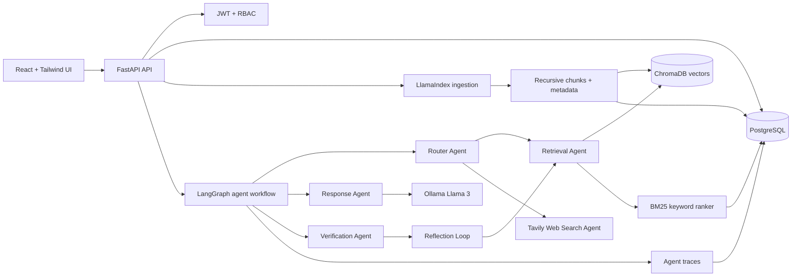

# Architecture

## Agent Workflow

The router chooses internal, web, or hybrid routing based on workspace context and currentness signals. Retrieval combines dense Chroma search with BM25 ranking from PostgreSQL-backed chunks. Tavily augments answers when fresh external knowledge is needed. The response agent calls Ollama and requires citation markers. Verification checks evidence coverage and citation validity, then triggers bounded reflection when confidence is below the configured threshold.

## Storage

PostgreSQL stores users, roles, workspaces, document metadata, chunk metadata, conversations, messages, feedback, analytics traces, and evaluation reports. ChromaDB stores normalized vector embeddings and retrieval metadata. Uploaded files are parsed immediately; object storage can be added behind the document service later.

## Configuration

Runtime behavior is controlled through environment variables in `.env.example`, including retrieval weights, chunk sizes, Ollama model, embedding model, Tavily key, and reflection thresholds.
